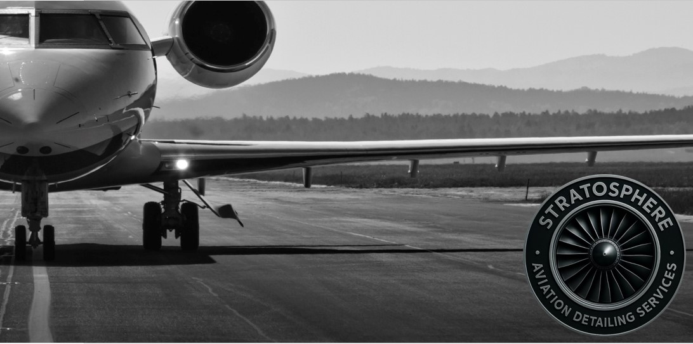
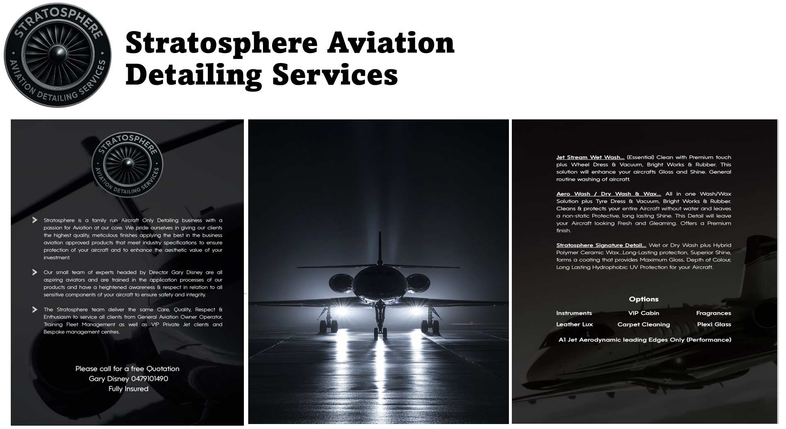
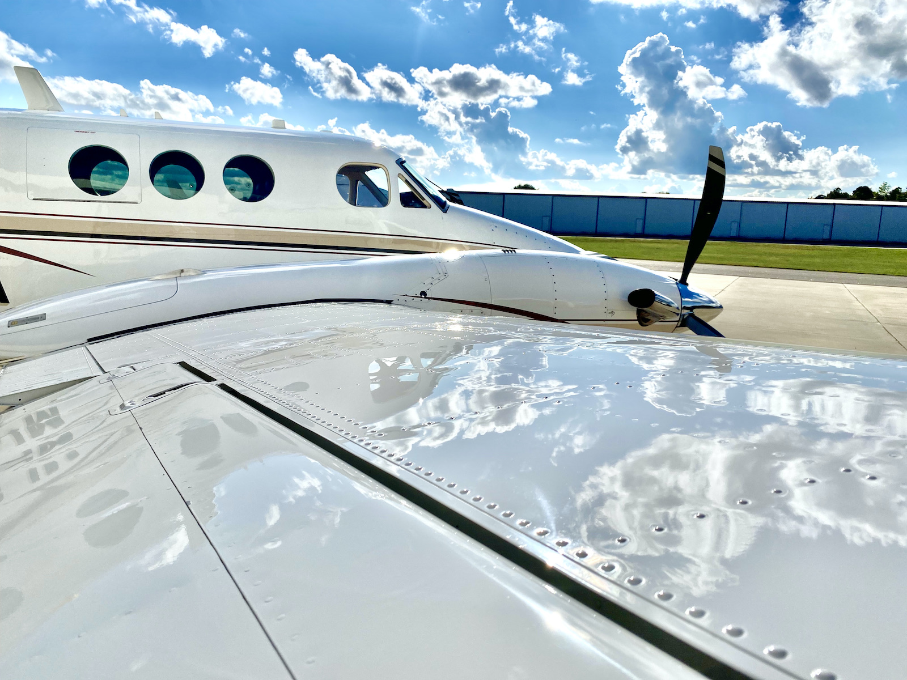
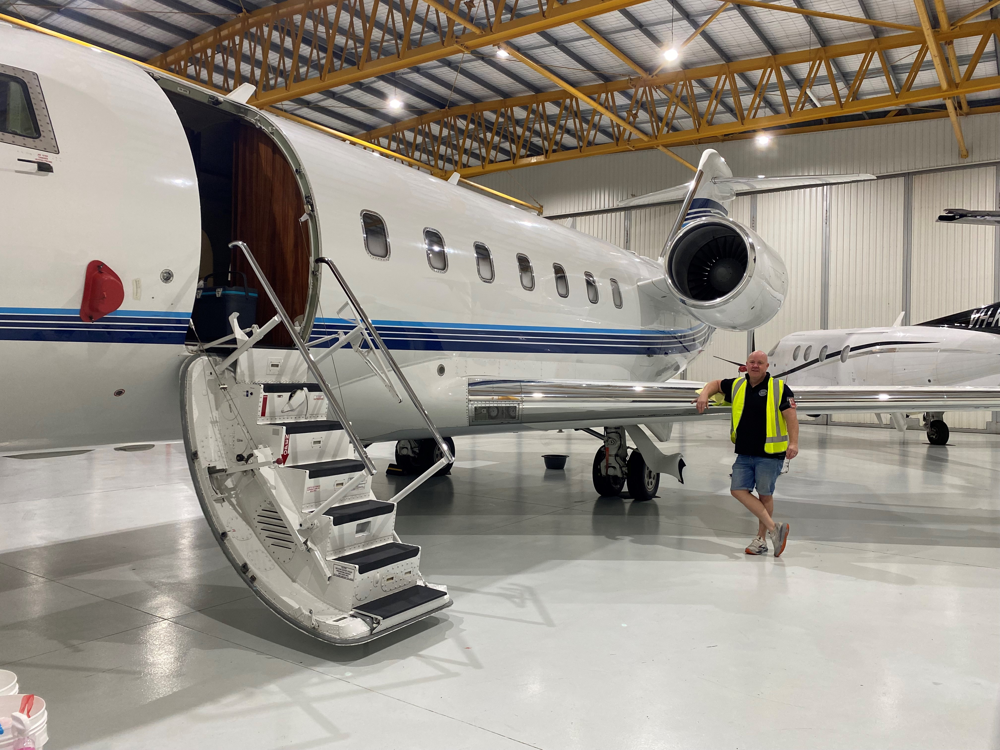
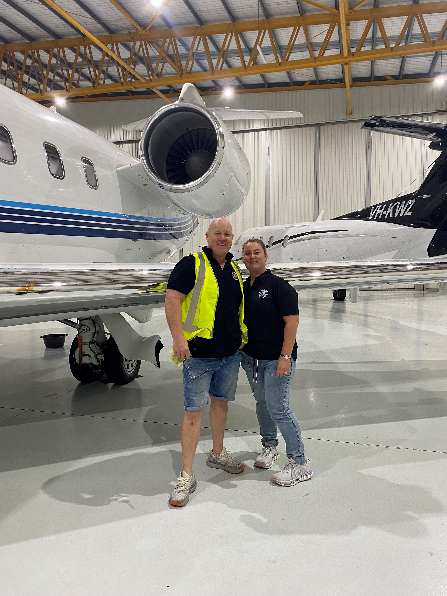
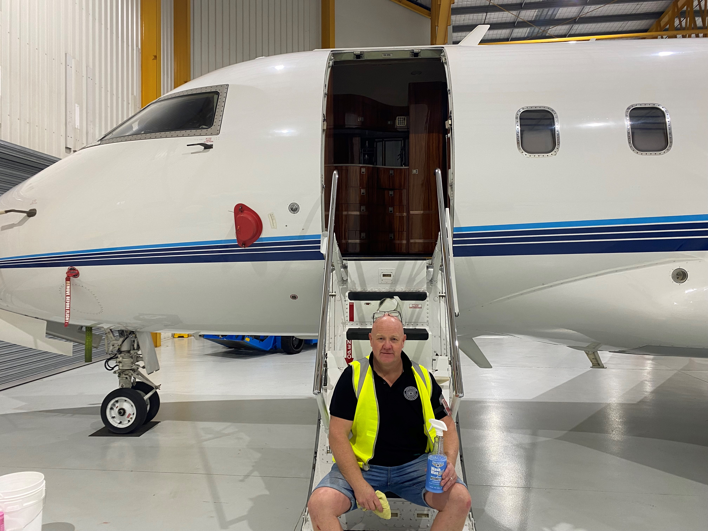
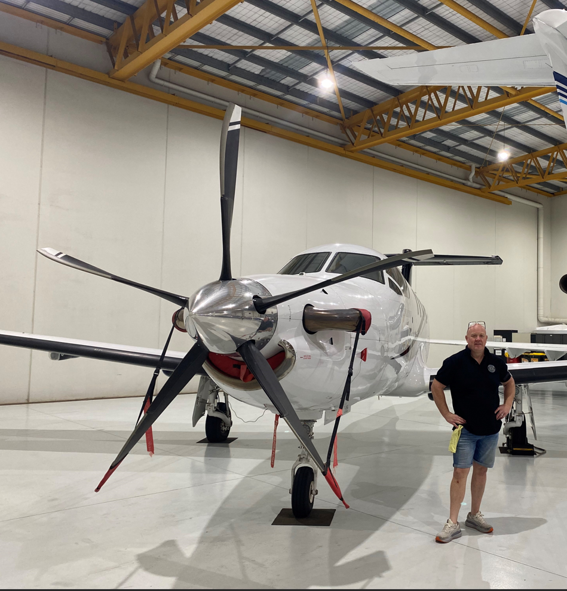
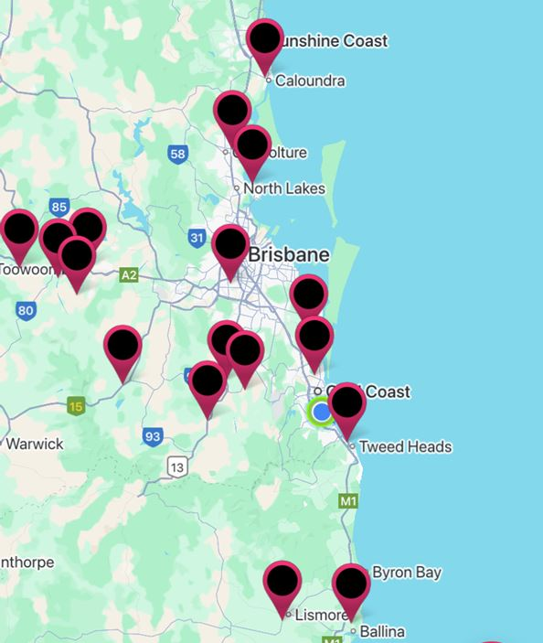

<!DOCTYPE html>
<html lang="en">
<head>
  <meta charset="UTF-8" />
  <meta name="viewport" content="width=device-width, initial-scale=1.0"/>
  <title>Stratosphere Aviation Detailing</title>
  <meta name="description" content="Premium aircraft detailing across Southeast Queensland and Northern NSW. Specialising in private, training, and FBO contracts." />
  <link rel="icon" href="favicon.ico" type="image/x-icon">
  
  <link rel="stylesheet" href="https://cdnjs.cloudflare.com/ajax/libs/font-awesome/6.5.0/css/all.min.css" crossorigin="anonymous" />
</head>
<body>
  <a class="whatsapp-button" href="https://wa.me/61479101490" target="_blank" title="Chat with us on WhatsApp">
    <i class="fab fa-whatsapp"></i>
  </a>

  <header>
    
    <h1>Stratosphere Aviation Detailing</h1>
    
Premium aircraft detailing across SE QLD and Northern NSW

  </header>

  

    
<h2>Welcome</h2>

     
    

      
<strong>Welcome to Stratosphere Aviation Detailing</strong>

      
<em>Where Perfection Takes Flight.</em>

      

        We offer premium aircraft detailing across Southeast Queensland and Northern NSW. 
        Use the menu to explore our services, photos, coverage areas, and booking options.
      

    

  

  

    
<h2>Our Services</h2>

     
    <ul>
      <li>Interior & exterior aircraft cleaning</li>
      <li>Paintwork polishing and protection</li>
      <li>Brightwork & plexiglass polishing</li>
      <li>Cabin deodorising and deep cleaning</li>
      <li>FBO and flying school contracts</li>
      <li>Emergency / short-notice callouts</li>
    </ul>
    

      
    

  

  

    
<h2>Our Work</h2>

     
    

      
      
      
      
      
    

  

  

    
<h2>Our Products</h2>

    

      
    

  

  

    
<h2>Service Coverage</h2>

     
    
We proudly service North New South Wales and Southeast Queensland including Toowoomba, Archerfield, and the Sunshine Coast.

    

      
    

  

  

    
<h2>Contact Us</h2>

     
    
<strong>Email:</strong> <a href="mailto:stratosphereads@yahoo.com">stratosphereads@yahoo.com</a>

    
<strong>Phone:</strong> <a href="tel:+61479101490">0479 101 490</a>

    
<strong>Facebook:</strong> <a href="https://www.facebook.com/profile.php?id=61577069496524" target="_blank">Stratosphere Aviation Detailing Services</a>

    
<strong>Instagram:</strong> <a href="https://www.instagram.com/gary.alandisney/" target="_blank">@gary.alandisney</a>

  

  

    
<h2>Book a Service</h2>

     
    
Ready to give your aircraft the shine it deserves? Book now!

    <a href="mailto:stratosphereads@yahoo.com">Book via Email</a>
  

  <footer>
    
<strong>Stratosphere Aviation Detailing Services</strong>

    

      <a href="mailto:stratosphereads@yahoo.com">stratosphereads@yahoo.com</a> |
      <a href="https://stratosphereaviationdetailing.com.au" target="_blank">stratosphereaviationdetailing.com.au</a>
    

    
ABN: 83623559197

    
Servicing Southeast Queensland & Northern New South Wales

    

      <a href="https://www.facebook.com/profile.php?id=61577069496524" target="_blank">Facebook</a> |
      <a href="https://www.instagram.com/gary.alandisney/" target="_blank">Instagram</a>
    

  </footer>
</body>
</html>
