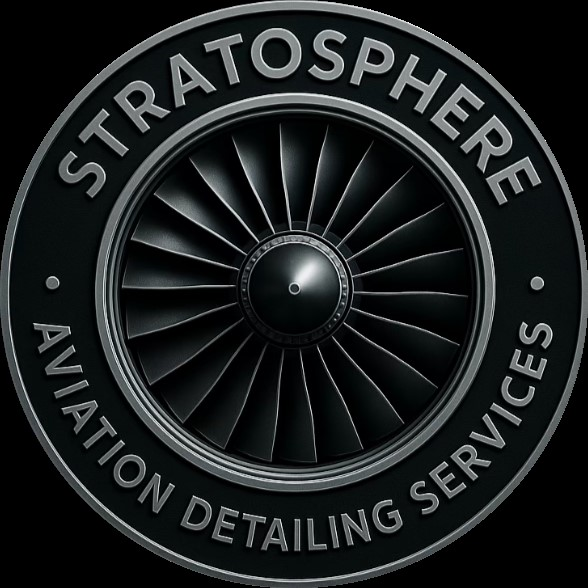
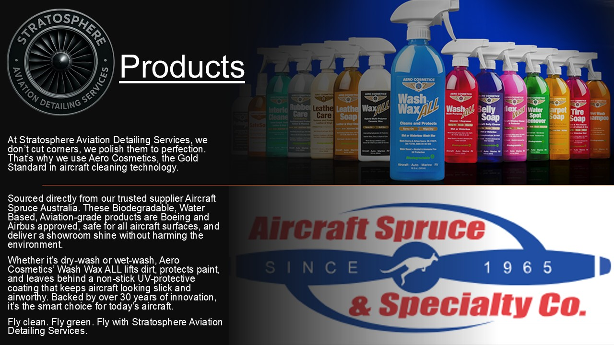

<!DOCTYPE html>
<html lang="en">
<head>
  <meta charset="UTF-8" />
  <meta name="viewport" content="width=device-width, initial-scale=1.0"/>
  <title>Stratosphere Aviation Detailing</title>
  <meta name="description" content="Premium aircraft detailing across Southeast Queensland and Northern NSW. Specialising in private, training, and FBO contracts." />
  <link rel="icon" href="favicon.ico" type="image/x-icon">
  
  <link rel="stylesheet" href="https://cdnjs.cloudflare.com/ajax/libs/font-awesome/6.5.0/css/all.min.css" integrity="sha512-p9xUtgJwGq4T3tB6MTI1+iV5X1p3BoH4FfL1KUt5kPeQ3w05GVn3T6kCAXq/udfrvEcjP13TivCEuN+eL+Hedg==" crossorigin="anonymous" referrerpolicy="no-referrer" />
</head>
<body>
  <a class="whatsapp-button" href="https://wa.me/61479101490" target="_blank" title="Chat with us on WhatsApp">
    <i class="fab fa-whatsapp"></i>
  </a>

  <header>
    
    <h1>Stratosphere Aviation Detailing</h1>
    
Premium aircraft detailing across SE QLD and Northern NSW

  </header>

  <nav>
    <a href="#">Home</a>
    <a href="#services">Services</a>
    <a href="#photos">Photos</a>
    <a href="#products">Products</a>
    <a href="#coverage">Coverage</a>
    <a href="#contact">Contact</a>
    <a href="#book">Book Now</a>
  </nav>

  <section id="about">
    <h2>About Us</h2>
    
Stratosphere Aviation Detailing provides elite cleaning and detailing for light aircraft, flying schools, FBOs, maintenance hangars and private owners across Southeast Queensland and Northern New South Wales. With rapid call-outs and a commitment to quality, we leave every aircraft gleaming and airworthy.

  </section>

  <section id="services">
    <h2>Our Services</h2>
    <ul>
      <li>Interior & exterior aircraft cleaning</li>
      <li>Paintwork polishing and protection</li>
      <li>Brightwork & plexiglass polishing</li>
      <li>Cabin deodorising and deep cleaning</li>
      <li>FBO and flying school contracts</li>
      <li>Emergency / short-notice callouts</li>
    </ul>
    

      
    

  </section>

  <section id="products">
    <h2>Our Products</h2>
    
We use and recommend professional-grade aviation-safe products for cleaning, polishing, and protecting your aircraft surfaces.

    

      
    

  </section>

  <section id="photos" class="photos">
    <h2>Our Work</h2>
    
    
    
  </section>

  <section id="coverage">
    <h2>Service Coverage Areas</h2>
    <ul>
      <li>North New South Wales</li>
      <li>Southeast Queensland</li>
      <li>Toowoomba</li>
      <li>Archerfield</li>
      <li>Sunshine Coast</li>
    </ul>
  </section>

  <section id="book" class="book-now">
    <h2>Ready to Book?</h2>
    
We offer short-notice appointments and flexible scheduling. Contact us now to get your aircraft looking its best!

    <a href="mailto:stratosphereads@yahoo.com">Book Now via Email</a>
  </section>

  <section id="contact">
    <h2>Contact Us</h2>
    <form action="https://formspree.io/f/mlekrpyw" method="POST">
      <label>Name: <input type="text" name="name" required></label>  
      <label>Email: <input type="email" name="email" required></label>  
      <label>Message: <textarea name="message" rows="5" required></textarea></label>  
      <button type="submit">Send Message</button>
    </form>
    
<strong>Phone:</strong> 0479 101 490

    
<strong>Email:</strong> <a href="mailto:stratosphereads@yahoo.com">stratosphereads@yahoo.com</a>

    
<strong>Location:</strong> Gold Coast, QLD, Australia

  </section>

  <footer>
    
&copy; 2025 Stratosphere Aviation Detailing. All rights reserved.

    

      <a href="https://www.facebook.com/profile.php?id=61577069496524" target="_blank"><i class="fab fa-facebook"></i> Facebook</a>
      <a href="https://www.instagram.com/gary.alandisney/" target="_blank"><i class="fab fa-instagram"></i> Instagram</a>
    

  </footer>
</body>
</html>
